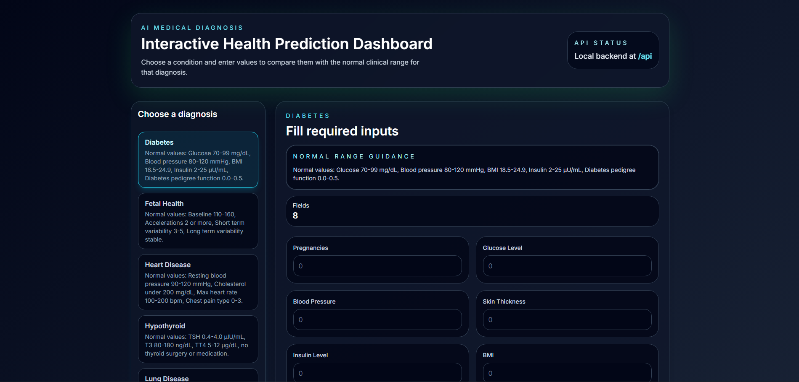

🏥 AI-Powered Medical Diagnosis System

 <b>Intelligent Healthcare • Machine Learning • Full-Stack Deployment</b>  Predict multiple diseases using AI-driven models with a seamless user experience. 

      

🚀 Live Demo

🔗 https://ai-powered-medical-diagnosis-system-s8z7.onrender.com/

🖼️ Application UI

Here’s a preview of the system interface:

  

---📌 Project Overview
A full-stack AI healthcare platform that predicts multiple diseases using machine learning models with a modern interactive dashboard.

🧠 System Architecture
User → React Frontend → Flask API → ML Models → Prediction → UI Response
⚙️ Core Components

🧠 Machine Learning Layer
Trained on medical datasets
Supports:
Diabetes
Heart Disease
Lung Disease
Parkinson’s
Hypothyroid
Migraine
Fetal Health
Export formats:
.sav, .pkl, .joblib

⚙️ Backend (Flask)
Loads ML models at startup
API endpoints:
/predict
/analyze
Handles preprocessing + inference
Returns JSON responses

🎨 Frontend (React Dashboard)
Interactive disease selection
Real-time form inputs
Normal range guidance display
Clean dark-themed UI
Dynamic prediction results

📦 Deployment (Docker)
Full containerized system
Includes backend + frontend + ML models
Portable across environments

🛠️ Local Setup
Clone Repo
git clone https://github.com/your-username/your-repo.git
cd your-repo
Build Frontend
cd frontend
npm install
npm run build
Run Backend
cd ..
pip install -r requirement.txt
python backend/api.py
🐳 Docker Setup
Build
docker build -t medical-app .
Run
docker run -p 5000:5000 medical-app
☁️ Deployment (Render)

Deployed using Render with Docker.

✅ Required
app.run(host="0.0.0.0", port=int(os.environ.get("PORT", 5000)))
❌ Avoid
ssl_context='adhoc'
📊 Tech Stack
Layer	Technology
Frontend	React
Backend	Flask
ML Models	Scikit-learn
Deployment	Docker + Render
⚡ Features
🧠 Multi-disease prediction
⚡ Fast ML inference
📊 Real-time analysis
🎨 Clean dashboard UI
🌐 Cloud deployment ready
🚀 Future Enhancements
📈 Explainable AI
🧑‍⚕️ Doctor dashboard
📱 Mobile app
📊 Visual analytics
⭐ Support

If you like this project:

⭐ Star the repo
🔁 Share it
💼 Use in portfolio
